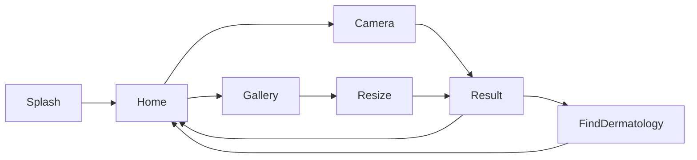

# skinscanner_and

> 피부 병변 사진을 온디바이스 TensorFlow Lite 모델로 분석해 피부암 가능성을 알려 주고, 주변 피부과를 찾아 주는 Android 앱 (앱 이름: **AI 피부암 검사**)
## 목차

- [Quick Start](#quick-start)
- [주요 기능](#주요-기능)
- [기술 스택](#기술-스택)
- [설치](#설치)
- [설정](#설정)
- [프로젝트 구조](#프로젝트-구조)
- [모델 추론](#모델-추론)
- [테스트](#테스트)
- [트러블슈팅](#트러블슈팅)

## Quick Start

[설정](#설정)에 나온 3개 파일(`secret.properties`, `google-services.json`, `cancer_quantized.tflite`)을 먼저 준비한 뒤 실행합니다.

```bash
git checkout develop
./gradlew :app:installDebug
```

## 주요 기능

| 기능 | 설명 | 관련 화면 |
| --- | --- | --- |
| 앱 시작 검사 | 루팅 여부 확인, Firebase Realtime Database로 앱 버전 확인, 서버와 RSA 키 교환, 모델 파일 해시 검증 | `SplashFragment` |
| 카메라 촬영 분석 | CameraX로 병변을 촬영한 뒤 모델로 분석 | `CameraFragment` |
| 갤러리 이미지 분석 | 갤러리에서 사진을 고르고 자른(crop) 뒤 모델로 분석 | `GalleryFragment` → `ResizeFragment` |
| 결과 표시 | 암 여부와 종류(광선각화증 및 상피내암 / 기저 세포 암 / 흑색종), 확률 표시 | `ResultFragment` |
| 주변 피부과 찾기 | 현재 위치 기준으로 Kakao 키워드 검색 API와 Kakao Map을 이용해 주변 피부과 표시 | `FindDermatologyFragment` |
| 보상형 광고 | 분석 전에 AdMob 보상형 광고 표시 | `CameraFragment`, `ResizeFragment` |

화면 흐름:



## 기술 스택

| 분류 | 사용 기술 |
| --- | --- |
| 언어 / 빌드 | Kotlin 1.9.0, AGP 8.5.0, Gradle Kotlin DSL + `buildSrc` (버전·라이브러리 관리) |
| SDK | minSdk 29, targetSdk / compileSdk 34 |
| 아키텍처 | MVVM (ViewModel + StateFlow), Repository 패턴, Hilt (DI) |
| UI | DataBinding, Navigation Component + Safe Args, Lottie, Glide, Android Image Cropper |
| ML | TensorFlow Lite 2.16.1, TFLite Support Library |
| 카메라 | CameraX 1.3.4 |
| 네트워크 | Retrofit2 |
| 외부 서비스 | Firebase (Crashlytics, Analytics, Realtime Database), Kakao SDK / Kakao Map, AdMob, Play Services Location |
| 저장소 | DataStore Preferences |

라이브러리 버전은 `buildSrc/src/main/kotlin/Versions.kt`에서 한곳에 관리합니다.

## 설치

### 전제조건

- Android Studio (AGP 8.5.0 지원 버전)
- JDK 17
- Android 10 (API 29) 이상 기기 또는 에뮬레이터 (카메라 기능은 실기기 권장)

### 빌드 및 실행

```bash
# debug APK 빌드
./gradlew :app:assembleDebug

# 연결된 기기에 설치
./gradlew :app:installDebug
```

## 설정
아래 3개 파일은 `.gitignore`에 포함되어 저장소에 없습니다. 빌드 전에 직접 준비해야 합니다.

| 파일 | 위치 | 용도 |
| --- | --- | --- |
| `secret.properties` | 프로젝트 루트 | API 키, 서버 URL, 광고 ID |
| `google-services.json` | `app/` | Firebase 연동 |
| `cancer_quantized.tflite` | `app/src/main/assets/` | 피부암 분류 모델 |

## 프로젝트 구조

```text
app/src/main/java/com/glion/skinscanner_and/
├── data/
│   ├── api/         # Retrofit 서비스 (Kakao, 자체 서버), NetworkDatasource
│   ├── datastore/   # DataStore Preferences
│   ├── location/    # 위치 조회 (Play Services Location)
│   └── tflite/      # TFLite 모델 DI, TfliteRepository (전처리·추론·결과 해석)
├── ui/
│   ├── base/        # BaseActivity / BaseFragment / BaseDialogFragment
│   ├── intro/       # 스플래시 (시작 검사)
│   ├── home/ camera/ gallery/ result/ find_dermatology/
│   └── dialog/      # 공통 다이얼로그, 로딩 다이얼로그
└── util/            # LogUtil, CryptoUtils, RootCheck, AdMob, 확장 함수
buildSrc/src/main/kotlin/
├── AppConfig.kt     # SDK 버전, 앱 버전
├── Versions.kt      # 라이브러리 버전
├── Library.kt       # 의존성 좌표
└── Plugin.kt        # 플러그인 ID
```

## 모델 추론

추론은 `data/tflite/reppository/TfliteRepositoryImpl.kt`의 `cancerAnalyze()`에서 처리하며, 카메라 화면과 갤러리 화면이 함께 사용합니다.

1. 저장된 입력 이미지(`InputFile`)를 Bitmap으로 불러옵니다.
2. 전처리: `260 x 260` 크기, RGB 3채널, `UINT8` 형식의 `TensorImage`로 바꿉니다 (입력 shape `(1, 260, 260, 3)`).
3. 추론: `Interpreter.run()`을 실행하면 길이 4의 `FloatArray`가 나옵니다.
4. 결과 해석:
   - `output[0]`에 sigmoid를 적용한 값이 암일 확률입니다. `0.5` 이상이면 암으로 판단합니다.
   - 암이면 `output[1..3]` 중 가장 큰 값의 위치로 종류를 정합니다 (1: 광선각화증 및 상피내암, 2: 기저 세포 암, 3: 흑색종).

### 추론 시간 로그

debug 빌드에서는 분석할 때마다 전처리, 추론, 전체 소요 시간을 Logcat에 출력합니다. Logcat을 `glion` 태그로 필터링하면 확인할 수 있습니다.

```text
전처리 : 12ms, 추론 : 85ms, 총 소요시간 : 97ms
```

(위 숫자는 형식을 보여 주는 예시이며, 실제 값은 기기마다 다릅니다.)

`LogUtil`은 `BuildConfig.DEBUG`가 `true`일 때만 로그를 출력하므로 release 빌드에서는 이 로그가 나오지 않습니다.

## 테스트

| 테스트 | 위치 | 내용 |
| --- | --- | --- |
| 데이터셋 일괄 추론 | `app/src/androidTest/.../InstrumentedDataSetTestUseTensorflowLight.kt` | `DATA_SET_URL`에서 이미지 10,015장(`1.jpg` ~ `10015.jpg`)을 내려받아 4개 스레드로 추론하고 결과를 로그로 출력 |

```bash
# 계측 테스트 (기기 연결 필요, 네트워크 사용)
./gradlew :app:connectedDebugAndroidTest
```

## 트러블슈팅

| 증상 | 원인 | 해결 |
| --- | --- | --- |
| `secret.properties (No such file or directory)` | 루트에 `secret.properties`가 없음 | [secret.properties](#secretproperties) 표를 보고 파일을 만든다 |
| `File google-services.json is missing` | Firebase 설정 파일이 없음 | Firebase 콘솔에서 받은 파일을 `app/`에 넣는다 |
| 분석할 때 `FileNotFoundException: cancer_quantized.tflite` | 모델 파일이 assets에 없음 | `app/src/main/assets/cancer_quantized.tflite`에 모델을 넣는다 |
| `BuildConfig` 필드에서 문법 오류 | `buildConfigField` 값에 따옴표가 없음 | `secret.properties`의 문자열 값을 큰따옴표로 감싼다 |
